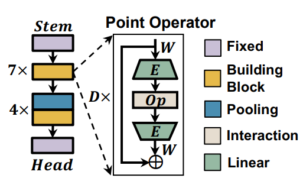
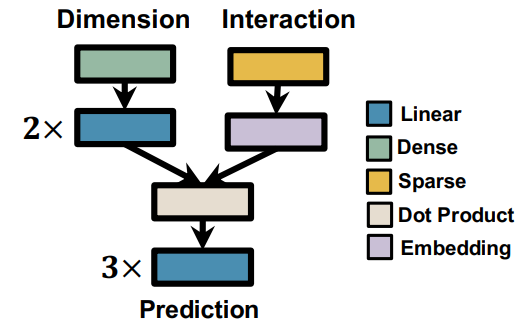

## [WACV'23] PIDS: Joint Interaction-Dimension Search for 3D Point Cloud

This is the official implementation of our WACV'23 paper, "PIDS: Joint Interaction-Dimension Search for 3D Point Cloud" [https://openaccess.thecvf.com/content/WACV2023/html/Zhang_PIDS_Joint_Point_Interaction-Dimension_Search_for_3D_Point_Cloud_WACV_2023_paper.html]. The framework is based developed upon PyTorch.

### Highlights
- Point-operators that compose both point interactions and point dimensions are implemented under `pids_core/models/blocks.py`. The first-order point interaction is implemented under `pids_core/models/attention.py`.



- Dense-Sparse predictor that intuited by the idea of "Wide & Deep Learning" to learn a better architecture prediction. The predictor is called in `pids/predictor/predictor_model_zoo.py` and implemented in `nasflow/algo/surrogate/predictor`.



### Starter Guide

- Installing prerequisite. We provide a conda environment file `pids_env.yaml` for you to start with. To install all files that fullfill the requirement, you can run the following command:

```sh
conda create -n pids -f pids_env.yaml
```

- To get the dataset, please refer to `tutorials/architecture_search_guidelines.ipynb` and place it under the folder of your interest.

- **(Recommended)**. It's better to re-compile the cpp wrappers to fit the runtime of your current machine. Simply go to `pids_core/cpp_wrappers` and run `compile_wrappers.sh` gets the job done.


### Architecture Search Process
Architecture search code is released for easy use and development. Please refer to `tutorials/architecture_search_guidelines.ipynb` for detailed instructions and hyperparameter guidance.

### Training the searched architectures from scratch
The searched architectures are revealed in `pids_search_space/arch_genotype.py`, defined as a composition of block args representing architecture compositions. If you run the search by yourself, you can modify `pids_search_space/arch_genotype.py` to incorporate the changes that you have. Please refer to `final_evaluation.ipynb` for detailed training scripts and hyperparameter definitions.

### Obtaining validation/test accuracy.
The evaluation process on 3D-point cloud is not as straight-forward as image classification. To obtain the validation/test accuracy, a voting mechansim is required that runs the point cloud multiple times and average the predictions.

### Evaluation

Our paper presents the following results. More detailed comparisons can be seen on the original paper.

Please refer to `testing/val_models.py` for the testing process. The general usage should be:

```bash
python testing/val_models.py --result_path [CKPT_PATH]
```

### Results

**SemanticKITTI** (08-val)
| Method | Parameter (M) | Multiply-Accumulates (G) | Latency (ms) | mIOU (%) | Notes
| --- | --- | --- | --- | --- | --- |
| KPConv | 14.8 | 60.9 | 221 (164 + 57) | 59.2 | 
| **PIDS (Second-order)** | 0.97 | 4.7 | 160 (103 + 57) | 60.1 |
| **PIDS (NAS)** | 0.57 | 4.4 | 169 (112 + 57) | 62.4 | [Checkpoint](https://duke.box.com/s/zwub488z696ilnwam8e7xoo2hnafo6id)
| **PIDS (NAS, 2x)** | 1.36 | 11.0 | 206 (149 + 57) | 64.1 | [Checkpoint](https://duke.box.com/s/yzhwtdxolk2xr8jgthy1iek9uzooicaa)


**S3DIS** (Area-05)

Refer to `training/train_S3DIS.py` for implementation details.

| Method | mIOU | ceil. | floor | wall | beam | col. | wind. | door | chair | table | book. | sofa | board | clut.|
| --- | --- | --- | --- | --- | --- | --- | --- | --- | --- | --- | --- | --- | --- | --- |
| **KPConv** | 65.4 | 92.6 | 97.3 | 81.4 | 0.0 | 16.5 | 54.5 | 69.5 | 90.1 | 80.2 | 74.6 | 66.4 | 63.7 | 58.1 |
| **PIDS** | 67.2 | 93.6 | 98.3 | 81.6 | 0.0 | 32.2 | 51.5 | 73.2 | 90.7 | 82.5 | 73.3 | 64.7 | 71.6 | 60.0 | 

Checkpoint is available [here](https://duke.box.com/s/infnzg7jn82s3lhbzp7b0wlhpxvpzi4y).

**ModelNet40**
| Method | Parameter (M) | Overall Accuracy (%) | Notes
| --- | --- | --- | --- |
| **KPConv** | 14.9 | 92.9 |
| **PIDS (Second-order)** | 1.25 | 92.6 |
| **PIDS (NAS)** | 0.56 | 93.1 | [Checkpoint](https://duke.box.com/s/fdkojw9f5wy4idb0kyej7kvw01q10se1)
| **PIDS (NAS, 2x)** | 1.21 | 93.4 | [Checkpoint](https://duke.box.com/s/psrcglwb2w1wtqj5xyaqz6mqtd4kerh4)


### Acknowledgement

This project is in part supported by the following grants: NSF-2112562, NSF-1937435, and ARO W911NF-19-2-0107, and CAREER-2048044. We also acknowledge the original KPConv-PyTorch project [https://github.com/HuguesTHOMAS/KPConv-PyTorch] to provide backbone implementations for our work.

### Citation
If you would like to use this repository to develop your research work, feel free to use the citation below:

```
@inproceedings{zhang2023pids,
  title={PIDS: Joint Point Interaction-Dimension Search for 3D Point Cloud},
  author={Zhang, Tunhou and Ma, Mingyuan and Yan, Feng and Li, Hai and Chen, Yiran},
  booktitle={Proceedings of the IEEE/CVF Winter Conference on Applications of Computer Vision},
  pages={1298--1307},
  year={2023}
}
```
